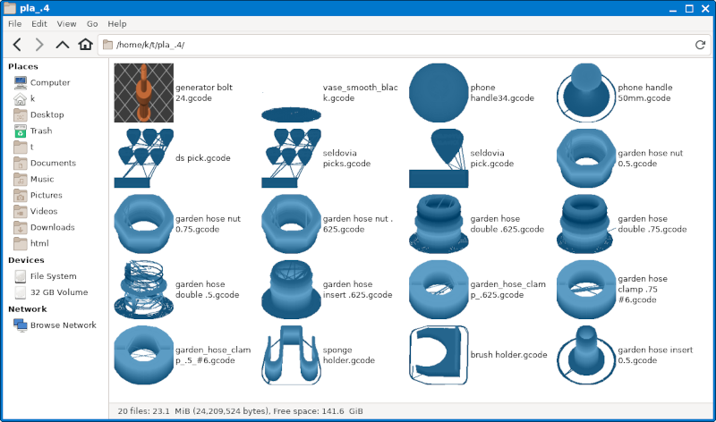

# gcodeThumb
Extracts thumbnails from `.gcode` headers, or renders them if not present.

Includes configuration of file managers to show embedded previews.

## Optional configuration.
You may optionally configure slicers to embed thumbnails.
If embedded thumbnails are present, `gcodeThumb.py` will extract them. They aren't necessary though. Some people prefer the generated thumbnails because they show extra details about the printing process.
  * [Configure Prusaslicer](https://duckduckgo.com/?q=Prusa+printer.ini+embed+thumbnails&ia=web)
  * [Configure Cura](https://github.com/Razor10021990/SnapmakerGcodeWriter)

This example shows an embedded thumbnail (orange) alongside our generated thumbnails (blue).

## Limitations
The code takes colossal shortcuts to minimize memory usage and dependencies. The parser doesn't support curves perfectly. It treats them as lines. The renderer fakes 3D by subtracting Y-Z. The shader is literally just layer height. But that's not all. Tracing the path of print head moves from gcode introduces unavoidable artifacts, including "layer lines," "skirts," "brims," and "purge towers." If the results are unsatisfactory, configure slicers to embed previews.

Written with Linux in mind. The Python parts should work on Windows, though. If not, [report an issue](https://github.com/themanyone/gcodeThumb/issues) ⏫ 

## Requirements
Python3. PIL image library.

## Installation

   * edit `inst.sh` and `uninst. sh` with your preferred install locations.

`inst.sh`

   * Clear cache to regenerate thumbnails.

`rm -rf ~/.cache/thumbnails`

Thunar requires `tumbler` to generate thumbnails.

Other file managers, like `pcmanfm` and `nautilus`, should work now.

## Troubleshooting

If no thumbnails are generated, follow the above instruction to clear the thumbnail cache. If it still doesn't work, edit the "MimeType=" line in `/usr/share/thumbnailers/gcode.thumbnailer`. Use `grep -i gcode /usr/share/mime/*` to discover what mimetypes the system is using and try those.

Sometimes GTK bugs out, and it becomes necessary to update its icon cache as well.

`gtk-update-icon-cache ~/.local/share/icons/hicolor/ -t`

Get recent code updates, or fork the project on GitHub. https://github.com/themanyone/gcodeThumb
