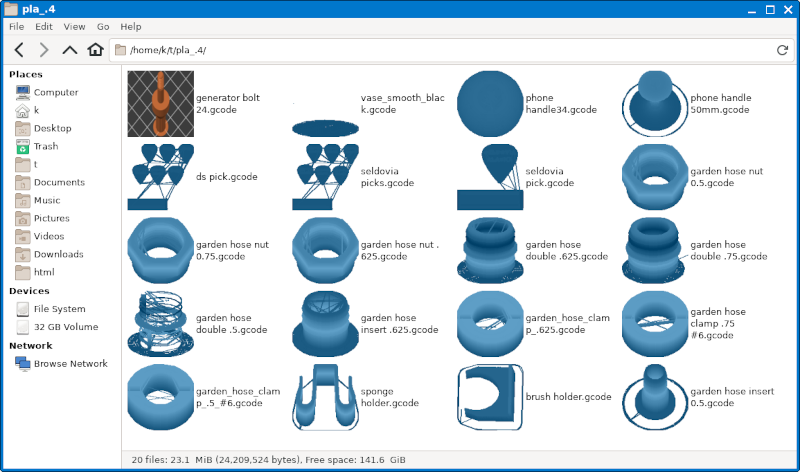

# gcodeThumb
Extracts thumbnails from `.gcode` headers, or renders them if not present.

Includes configuration of file managers to show embedded previews.

## Optional configuration.
You may optionally configure slicers to embed thumbnails.
If embedded thumbnails are present, `gcodeThumb.py` will extract them. They aren't necessary though.
  * PrusaSlicer-2.3.3 Look under Printer Settings and set G-Code thumbnails to 128x128, or the size of your printer display.
  * Older versions may need to [edit the ini files](https://duckduckgo.com/?q=Prusa+printer.ini+embed+thumbnails&ia=web)
  * [Configure Cura](https://github.com/Razor10021990/SnapmakerGcodeWriter)

This example shows an embedded thumbnail (orange) alongside our generated thumbnails (blue).


## Limitations
The code takes colossal shortcuts to minimize memory usage and dependencies. The parser doesn't support curves perfectly. It treats them as lines. The renderer fakes 3D by subtracting Y-Z. The shader is literally just layer height. But that's not all. Tracing the path of print head moves from gcode introduces unavoidable artifacts, including "layer lines," "skirts," "brims," and "purge towers." If the results are unsatisfactory, configure slicers to embed previews.

Written with Linux in mind. The Python parts should work on Windows, though. If not, [report an issue](https://github.com/themanyone/gcodeThumb/issues) ⏫ 

## Requirements
Python3. PIL image library.

## Linux Installation

   * edit `inst.sh` and `uninst. sh` with your preferred install locations.

`inst.sh`

Thunar requires `tumbler` to generate thumbnails.

It may be necessary to log out from the desktop session, or reboot.

Other file managers, like `pcmanfm` and `nautilus`, should work now.

## Windows Install

Make sure you have python installed.

Manually copy `gcodeThumb.py` to somewhere in `C:\Program Files`

Open regedit and navigate to `HKEY_CLASSES_ROOT\*.gcode`

Set the value of `ThumbnailHandler` to the location of `gcodeThumb.py`

## Troubleshooting

If no thumbnails are generated, clear cache to regenerate thumbnails and reboot or log out & log in.

`rm -rf ~/.cache/thumbnails`

If thumbnails still don't work, edit the "MimeType=" line in `~/.local/share/thumbnailers/gcode.thumbnailer`. Use `grep -i gcode /usr/share/mime/*` to discover what mimetypes the system is using and try those. Refer to `https://specifications.freedesktop.org/shared-mime-info-spec/` for complete documentation.

Sometimes GTK bugs out, and it becomes necessary to update its icon cache as well.

`gtk-update-icon-cache ~/.local/share/icons/hicolor/ -t`

## Adding on

From the mime info documentation above, we installed a file we createed called `Override.xml` in `~/.local/share/mime/packages`. It looks like this:

```<?xml version="1.0" encoding="UTF-8"?>
<mime-info xmlns="http://www.freedesktop.org/standards/shared-mime-info">
    <mime-type type="text/x.gcode">
        <sub-class-of type="text/plain"/>
        <comment>Gcode file</comment>
        <icon name="gcode"/>
        <glob-deleteall/>
        <glob pattern="*.gcode"/>
        <glob pattern="*.g"/>
        <glob pattern="*.gc"/>
        <glob pattern="*.nc"/>
        <glob pattern="*.ngc"/>
    </mime-type>
 </mime-info>
 ```
You can edit it and run `update-mime-database ~/.local/share/mime` to generate new types of thumbnails.

Get recent code updates, or fork the project on GitHub. https://github.com/themanyone/gcodeThumb

## Author's links

    - GitHub https://github.com/themanyone
    - YouTube https://www.youtube.com/themanyone
    - Mastodon https://mastodon.social/@themanyone
    - Linkedin https://www.linkedin.com/in/henry-kroll-iii-93860426/
    - [TheNerdShow.com](http://thenerdshow.com/)
